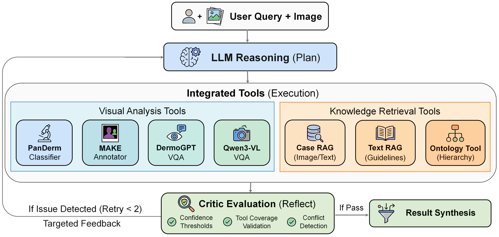

# DermAgent: A Self-Reflective Agentic System for Dermatological Image Analysis with Multi-Tool Reasoning and Traceable Decision-Making

[](https://arxiv.org/abs/2605.14403)
[](LICENSE)
[](https://www.python.org/downloads/)

A self-reflective agentic system for dermatological image analysis, built on LangChain/LangGraph.

DermAgent orchestrates seven specialist vision and language tools (PanDerm, MAKE, DermoGPT, Qwen3-VL, Case RAG, Guideline RAG, Ontology) within a **Plan-Execute-Reflect** framework, using GPT-4o as the reasoning backbone. A deterministic **Critic** module performs post-hoc auditing via confidence, coverage, and conflict gates to trigger targeted self-correction, delivering stepwise, traceable diagnostic reasoning.

## Architecture

<p align="center">
  
</p>

## Project Structure

```
DermAgent/
├── .agents/skills/              # Repo-level Codex skills
│   └── mayo-dermnet-corpus-pipeline/ # Guideline corpus reproduction contract
├── skin_agent/                  # Core agent framework
│   ├── benchmark_agent.py       # Benchmark agent + Critic + AnswerParser
│   ├── configs.py               # Dataset task configurations
│   ├── tracing.py               # TraceLogger, TracingCallback
│   ├── profiler.py              # Performance profiling
│   ├── resume.py                # Checkpoint/resume for long runs
│   ├── prompts.md               # System prompts
│   ├── tools/
│   │   ├── base.py              # BaseSkinTool, input schemas
│   │   ├── skin_tools.py        # All 7 tool implementations
│   │   ├── executor.py          # Tool execution orchestration
│   │   └── derm_knowledge_tree/ # Disease ontology JSONs
│   └── utils/
│       ├── retry.py             # Rate-limit retry logic
│       └── image_utils.py       # Image path handling
├── benchmark/                   # Unified evaluation framework
│   ├── run.py                   # CLI runner for single-model baselines
│   ├── metrics.py               # Shared metrics (classification, multilabel, captioning, VQA)
│   ├── models/                  # Model wrappers (GPT-4o, LLaVA-Med, HuatuoGPT, etc.)
│   └── datasets/                # Dataset configs with prompts and class lists
├── scripts/                     # All runnable scripts
│   ├── build_qdrant_db.py       # Build image RAG vector database
│   ├── build_qdrant_rag.py      # Build text RAG (guidelines)
│   ├── run_task1_ham10000_500_agent_dermogpt_full_critic.sh
│   ├── run_task1_snu_500_critic.sh
│   ├── run_task2_task3_agent_critic.sh
│   ├── run_task3_loo_ablation.sh
│   └── *.py                     # Python runner scripts
├── baselines/                   # Agent-based baseline reproductions
│   ├── MDAgents/                # MDAgents agent baseline (NeurIPS 2024)
│   ├── MedAgent-Pro/            # MedAgent-Pro agent baseline
│   └── SkinVL/                  # SkinVL-PubMM baseline
├── data/                        # Benchmark CSV metadata
├── requirements.txt
└── .env.example
```

## Setup

### 1. Environment

```bash
conda create -n dermagent python=3.10
conda activate dermagent

# Install PyTorch (match your CUDA version)
pip install torch torchvision --index-url https://download.pytorch.org/whl/cu126

pip install -r requirements.txt

# Download NLTK data (needed for BLEU/ROUGE metrics)
python -c "import nltk; nltk.download('punkt'); nltk.download('punkt_tab')"
```

### 2. API Keys

```bash
cp .env.example .env
# Edit .env: set OPENAI_API_KEY (required) and other variables as needed
```

### 3. External Dependencies

The following external code/data directories are required but not included in this repository due to size or licensing. Place them at the project root:

| Directory | Purpose | How to Obtain |
|-----------|---------|---------------|
| `Derm1M/src/` | Custom OpenCLIP fork for PanDerm & RAG encoders | Clone from the [Derm1M repository](https://github.com/SiyuanYan1/Derm1M) |
| `MAKE/src/` | Custom OpenCLIP fork for MAKE concept annotation | Clone from the [MAKE repository](https://github.com/SiyuanYan1/MAKE) |
| `MAKE/concept_annotation/term_lists/ConceptTerms.json` | Concept term definitions for MAKE | Included in the MAKE repository above |
| `model-weights/DermoGPT-RL` | DermoGPT-RL fine-tuned model weights | Download from the [DermoGPT repository](https://github.com/mendicant04/DermoGPT) |
| `MM-Skin/` | LLaVA package used by the SkinVL-PubMM baseline | Clone from the [MM-Skin repository](https://github.com/ZwQ803/MM-Skin) |
| `model-weights/SkinVL-PubMM` | SkinVL-PubMM model weights for the baseline | Download from [HuggingFace `zwq803/SkinVL-PubMM`](https://huggingface.co/zwq803/SkinVL-PubMM) |
| `RAG/dermnet_chunks_cleaned.json` | DermNet guideline chunks for Text RAG | Follow the [corpus pipeline skill](.agents/skills/mayo-dermnet-corpus-pipeline/SKILL.md) |
| `RAG/mayo_chunks_cleaned.json` | Mayo Clinic guideline chunks for Text RAG | Follow the [corpus pipeline skill](.agents/skills/mayo-dermnet-corpus-pipeline/SKILL.md) |
| `datasets/Derm1M/` | Derm1M dataset for building image RAG index | Download from [Derm1M](https://github.com/SiyuanYan1/Derm1M) |

For Text RAG models, pre-download the embedding and reranker models into `model-weights/`:

```bash
# Pre-download Qwen3 Embedding and Reranker for Text RAG
huggingface-cli download Qwen/Qwen3-Embedding-8B --local-dir model-weights/Qwen3-Embedding-8B
huggingface-cli download Qwen/Qwen3-Reranker-0.6B --local-dir model-weights/Qwen3-Reranker-0.6B
```

### 4. Datasets

Download the following datasets and place images in the expected directories:

| Dataset | Task | Download | Image Directory |
|---------|------|----------|-----------------|
| HAM10000 | Diagnosis (7 classes, 642 imgs) | [ISIC Archive](https://dataverse.harvard.edu/dataset.xhtml?persistentId=doi:10.7910/DVN/DBW86T) | `datasets/ham10000/images/` |
| SNU | Diagnosis (134 classes, 500 imgs) | [SNU Quiz](https://figshare.com/articles/dataset/SNU_dataset/6454802) | `datasets/SNU/images/` |
| Derm7pt | Concept Annotation (7 concepts) | [Derm7pt](https://derm.cs.sfu.ca/Welcome.html) | `datasets/derm7pt/final_images/` |
| SkinCon | Concept Annotation (32 concepts) | [SkinCon](https://skincon-dataset.github.io/) | `datasets/skincon/final_images/` |
| SkinCAP | Captioning (100 imgs) | [SkinCAP](https://huggingface.co/datasets/joshuachou/SkinCAP) | `datasets/skin_cap/images/` |

Benchmark CSV metadata (split definitions) are included in `data/`.

### 5. RAG Vector Database

To reproduce the Mayo Clinic and DermNet source corpora without redistributing scraper code or article content, follow the repo-level [Mayo + DermNet corpus pipeline skill](.agents/skills/mayo-dermnet-corpus-pipeline/SKILL.md). It documents the Python environment, final pipeline, and JSON contract expected by `scripts/build_qdrant_rag.py`.

Install and start Qdrant (vector database server):

```bash
# Option A: Docker (recommended)
docker run -d -p 6333:6333 -v $(pwd)/qdrant_storage:/qdrant/storage qdrant/qdrant

# Option B: Local binary — see https://qdrant.tech/documentation/guides/installation/
```

Build the Qdrant vector databases:

```bash
# Image-based case retrieval (requires Derm1M dataset + Derm1M/src/)
python scripts/build_qdrant_db.py

# Guideline-grounded text retrieval (requires RAG/ JSON files)
python scripts/build_qdrant_rag.py
```

### 6. Model Weights

Most tool models are auto-downloaded from HuggingFace on first use:
- **PanDerm**: [DermLIP_PanDerm-base-w-PubMed-256](https://huggingface.co/redlessone/DermLIP_PanDerm-base-w-PubMed-256) (~2GB VRAM)
- **MAKE**: [MAKE](https://huggingface.co/xieji-x/MAKE) (~2GB VRAM)
- **Qwen3-VL**: [Qwen3-VL-8B-Instruct](https://huggingface.co/Qwen/Qwen3-VL-8B-Instruct) (~16GB VRAM, bfloat16)

Models that must be manually placed in `model-weights/`:
- **DermoGPT-RL**: See Step 3 above (~16GB VRAM, bfloat16)
- **Qwen3-Embedding-8B / Qwen3-Reranker-0.6B**: See Step 3 above (Text RAG)

Total GPU requirement: ~20-22GB for all tools loaded simultaneously.

### Table 1: Main Results

| Model | Type | HAM10000 (Acc.) | SNU (Acc.) | Derm7pt (F1-Macro) | SkinCon (F1-Macro) | SkinCAP (ROUGE-L) |
|-------|------|:---:|:---:|:---:|:---:|:---:|
| LLaVA-Med-v1.5 | Medical MLLM | 0.4424 | 0.0120 | 0.5170 | 0.1310 | 0.1532 |
| HuatuoGPT | Medical MLLM | 0.5140 | 0.0400 | 0.5343 | 0.0949 | 0.1432 |
| DermoGPT-RL | Dermatology MLLM | 0.5000 | 0.0920 | 0.5686 | 0.2072 | 0.1541 |
| SkinVL-PubMM | Dermatology MLLM | 0.4517 | 0.0340 | 0.5314 | 0.1320 | 0.1444 |
| Qwen3-VL-8B | General MLLM | 0.5109 | 0.0780 | 0.5370 | 0.2282 | 0.1247 |
| GPT-4o | General MLLM | 0.4891 | 0.1500 | 0.5414 | 0.2956 | 0.1633 |
| GPT-5.2 | General MLLM | 0.3598 | 0.1480 | 0.5386 | 0.2662 | 0.1235 |
| MDAgents | Medical Agent | 0.1682 | 0.1140 | 0.3614 | 0.2393 | 0.1199 |
| MedAgent-Pro | Medical Agent | 0.5763 | 0.1160 | 0.6482 | 0.1834 | 0.1148 |
| **DermAgent (Ours)** | **Medical Agent** | **0.6183** | **0.3260** | **0.6506** | **0.3295** | **0.1948** |

Commands to reproduce DermAgent results:

```bash
# HAM10000 Diagnosis
bash scripts/run_task1_ham10000_500_agent_dermogpt_full_critic.sh

# SNU Diagnosis
bash scripts/run_task1_snu_500_critic.sh

# Derm7pt + SkinCon + SkinCAP
bash scripts/run_task2_task3_agent_critic.sh
```

Commands to reproduce baseline results (see `baselines/README.md` for agent baselines):

```bash
# Single-model MLLM baselines (e.g., GPT-4o on HAM10000)
cd benchmark && python run.py --model gpt4o --dataset HAM10000_500

# MDAgents agent baseline
cd baselines/MDAgents && python run_derm_benchmark.py --dataset HAM10000 --difficulty basic --model gpt-4o

# MedAgent-Pro agent baseline
cd baselines/MedAgent-Pro && python Derm_Case_level.py --task 1 \
    --csv-path ../../datasets/ham10000/HAM10000_benchmark_500.csv \
    --image-dir ../../datasets/ham10000 --max-samples 500
```

### Table 2: Ablation Study (Leave-One-Out on SkinCAP)

| Configuration | ROUGE-L | Delta (%) |
|---------------|:---:|:---:|
| **Full Agent (w/ Critic)** | **0.1948** | **+12.8** |
| Full Agent (w/o Critic) | 0.1727 | --- |
| &nbsp;&nbsp;w/o Case RAG | 0.1580 | -8.5 |
| &nbsp;&nbsp;w/o Guideline RAG | 0.1628 | -5.7 |
| &nbsp;&nbsp;w/o DermoGPT | 0.1672 | -3.2 |
| &nbsp;&nbsp;w/o PanDerm | 0.1676 | -3.0 |
| &nbsp;&nbsp;w/o MAKE | 0.1679 | -2.8 |
| &nbsp;&nbsp;w/o Ontology | 0.1712 | -0.9 |

Command to reproduce ablation results:

```bash
# Runs 6 leave-one-out experiments sequentially (removes one tool at a time)
bash scripts/run_task3_loo_ablation.sh
```

The full agent result (w/ Critic, ROUGE-L: 0.1948) is produced by the Task 3 portion of `run_task2_task3_agent_critic.sh`. The "w/o Critic" baseline (0.1727) is produced by the LOO script's full-tool run without the Critic module.

## Tool Descriptions

| Tool | Model | Purpose |
|------|-------|---------|
| PanDerm Classifier | DermLIP | Zero-shot disease classification via CLIP similarity |
| MAKE Annotator | MAKE (OpenCLIP) | Dermoscopic concept extraction |
| DermoGPT VQA | DermoGPT-RL | Dermatology-specialized visual QA |
| Qwen3-VL VQA | Qwen3-VL-8B | General visual question answering |
| Image RAG | DermLIP + Qdrant | Case retrieval from 413,210 diagnosed cases |
| Text RAG | Qwen3-Embedding + Qdrant | Guideline retrieval from 3,199 document chunks |
| Ontology | Knowledge Graph | Disease hierarchy and taxonomy queries |

## Citation

Paper: [arXiv:2605.14403](https://arxiv.org/abs/2605.14403) (MICCAI 2026, early accept).

```bibtex
@article{liu2026dermagent,
  title={DermAgent: A Self-Reflective Agentic System for Dermatological Image
         Analysis with Multi-Tool Reasoning and Traceable Decision-Making},
  author={Liu, Yize and Yan, Siyuan and Hu, Ming and Ju, Lie and Li, Xieji and
          Tang, Feilong and Feng, Wei and Ge, Zongyuan},
  journal={arXiv preprint arXiv:2605.14403},
  year={2026}
}
```

## License

This project is licensed under the **Apache License 2.0** — see the [LICENSE](LICENSE) file for the full text.

DermAgent redistributes adapted code from third-party projects under the
`baselines/` directory. See [NOTICE](NOTICE) and the per-baseline
`ATTRIBUTION.md` files for upstream sources, citations, and license status.
